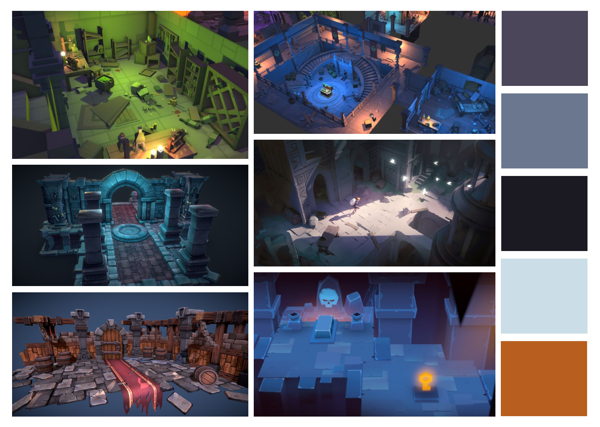
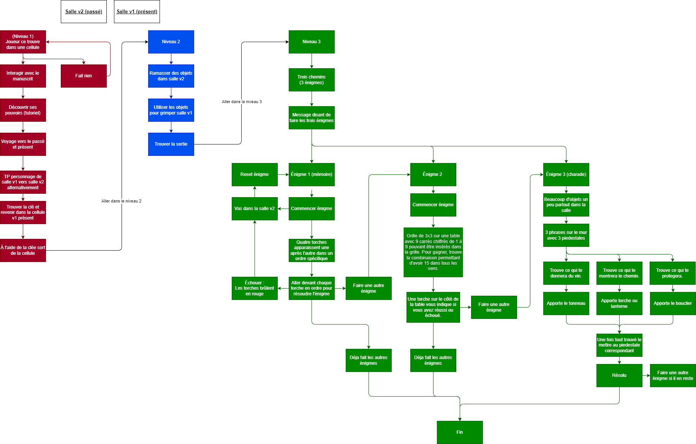

# Plan-de-travail-final-vr

## Résumé

Escape game dans un donjon dans lequel on a des énigmes, parcours et autres épreuves pour s'échapper.

- **Salle 1:** Début de l'aventure dans une cellule dans un dunjon, le joueur doit trouver comment s'en échapper.
 
- **Salle 2:** Parcours style blade & sorcery pour se rendre à la salle 3.
 
- **Salle 3:** Dans cette salle, on peut retrouver 3 énigmes à résoudre dans un certain temps donné.

## Description écrite
Le jeu débute alors que le joueur se réveille emprisonné dans la cellule d'un donjon en ruine. Sur le sol, se trouve un manuscrit décrivant le contexte de l'histoire ainsi que les consignes du jeu. Parmi ceux-ci, le joueur apprend qu'il peut, à l'aide d'un sort (appuyer sur X), voyager entre le passé et le présent. Le joueur va alors devoir apprendre a utiliser ses pouvoirs pour s'échapper de sa cellule, résoudre des énigmes et tous autres obstacles se présentant sur son chemin. **Le présent** est démoli, en ruine et l'athmosphère est dense, alors que **le passé** est en bon état, comme neuf et donne l'impression que le donjon vient d'être construit.

## Chaques salles

- **Salle 1:** Avant de pouvoir interagir avec quoi que ce soit, le joueur doit prendre et lire le manuscrit se trouvant au sol. Ensuite, il doit utiliser son pouvoir temporel pour aller chercher la clé de la cellule dans le passé et la ramener au présent.
 
- **Salle 2:** Arrivant au parcours, le joueur observe une grande salle dans laquelle on peut voir une porte au fond de la salle. Pour s'y rendre, le joueur doit franchir le gouffre séparant le joueur de la sortie. Le parcours présente plusieurs embûches de différents niveaux demandant une bonne agilité, des talents en escalade et en sauts, mais surtout l'utilisation du temps pour contourner certains problèmes environnementaux.
 
- **Salle 3:** En entrant dans la 3e salle, le joueur remarque 3 couloirs présentant chacun un défi. Chaque défi détient sa propre difficulté. Il sera nécessaire de vaincre chaque énigme pour s'échapper et retrouver la liberté.
  
- **Réussite:** Vous avez réussi et vous vous retrouvez a l'extérieur.

## Bonus

- **Salle *Easter egg*:** Depuis la salle 2 du parcours, chemin secondaire permettant de se rendre à une chambre au trésor donnant certains avantages et surtout de l'or.

## Énigmes de la salle 3

- **Énigme 1:** Jeu de mémoire.
 
- **Énigme 2:** Sur une table se retrouve un socle contenant une grille de 3x3 contenant des dalles carrées chiffrées de 1 à 9. Le joueur doit ensuite les placer dans un certain ordre sur la grille pour faire en sorte que la somme des chiffres de n'importe quelle colonne, ligne ou diagonale égale à 15.
 
- **Énigme 3:** Lier les objets à des charades.

## Moodboard

## Schéma de programmation et d'interactivité.

## Carte

## Ambience sonore 
- [Ambience 1](https://www.youtube.com/watch?v=bxoRRobHtGM&t=151s)

- [Ambiance 2](https://youtu.be/DRFHklnN-SM) (On se concentre sur la melodie)

- [Son téléportation](audio/tp_sound_idea.wav)

Pour la première ambiance, nous cherchons une atmosphère plutôt sombre, qui illustre bien l’environnement détruit et le sentiment mystérieux du cachot. Des sons comme des craquements, des cris silencieux, des oiseaux ou chauffe-souris, pour vraiment vendre l’idée que ce cachot n’est plus habité et même un peu hanté. Ensuite, pour la deuxième ambiance, nous cherchons quelque chose qui démontre la bonne nature du cachot lorsqu’il était propre et bien entretenu. De la musique qui joue, une ambiance calme, etc.

Pour les effets sonores importants, cela comporte le son de téléportation, les sons des pas, les sons des énigmes, des effets de glitch pour l’espace-temps rompu, sons de feux, etc.
